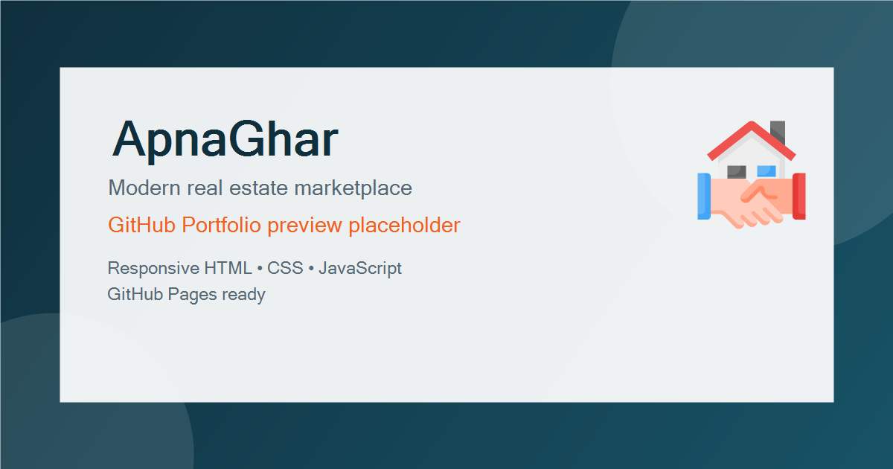

# ApnaGhar



ApnaGhar is a responsive real estate marketplace front end built with pure HTML, CSS, and vanilla JavaScript. It is polished for GitHub Portfolio presentation, GitHub Pages deployment, recruiter review, and a production-quality Lighthouse pass while preserving the original UI and behavior.

## Live Demo

Replace this placeholder with your published deployment URL.

- GitHub Pages: https://abhaykharat-bit.github.io/ApnaGhar/
- Netlify: Replace with your Netlify deployment URL
- Vercel: Replace with your Vercel deployment URL

## Screenshots

Add exported screenshots here when the final deployment is available.

```text
screenshots/
├── homepage-desktop.png
├── homepage-mobile.png
└── property-listings.png
```

## Features

- Responsive one-page real estate landing experience
- Accessible skip link, visible focus states, and keyboard-friendly navigation
- SEO metadata, Open Graph tags, Twitter Card tags, robots.txt, sitemap.xml, and JSON-LD structured data
- Lazy-loaded imagery with hero and logo preloads for better perceived performance
- Vanilla JavaScript navigation with reveal animations and loader handling
- GitHub Pages-ready relative asset paths
- Custom 404 page for static hosting

## Tech Stack

- HTML5
- CSS3
- Vanilla JavaScript
- Ionicons
- Google Fonts

## Folder Structure

```text
ApnaGhar/
├── index.html
├── 404.html
├── README.md
├── LICENSE
├── .gitignore
├── robots.txt
├── sitemap.xml
├── deal.png
└── assets/
    ├── css/
    │   └── style.css
    ├── js/
    │   └── script.js
    └── images/
        ├── about-banner-1.png
        ├── about-banner-2.jpg
        ├── blog-1.png
        ├── blog-2.jpg
        ├── blog-3.jpg
        ├── find-dream-home.jpg
        ├── service-1.png
        ├── service-2.png
        ├── service-3.png
        ├── 1stprp.jpg
        ├── 2ndprop.jpg
        ├── 4th.jpg
        ├── a'.png
        ├── small_Modern_Real_Estate_Agency_Logo_Template-removebg-preview.png
        ├── small_Modern_Real_Estate_Agency_Logo_Template-removebg-preview - Copy.png
        └── social-preview.png
```

## Installation

1. Clone the repository.
2. Open the project folder in VS Code or your preferred editor.
3. Launch `index.html` with a local server or open it directly in a browser.
4. For production deployment, publish the repository root as a static site.

## Future Improvements

- Connect the listing cards to real property detail pages
- Add a functional contact form with validation and submission handling
- Replace placeholder outbound links with live social and business profiles
- Add property filters and search for better discovery
- Generate final deployment-specific canonical, sitemap, and social preview URLs

## Author

ApnaGhar

## License

This project is licensed under the MIT License. See [LICENSE](LICENSE) for details.

## Acknowledgements

- Ionicons for the icon set
- Google Fonts for typography
- Browser static hosting platforms such as GitHub Pages, Netlify, and Vercel
